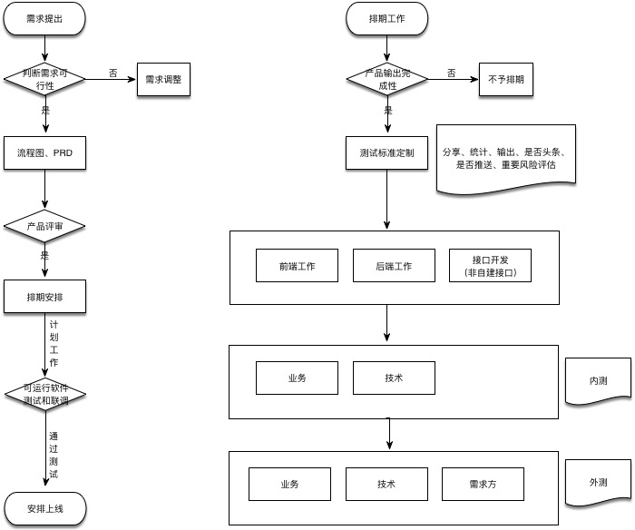

# 基本流程项目流程
项目和产品都是一个渐渐明细的过程在这个过程我们需要不停的对我们的想考的产物进行迭代更新，保留下来你思考的结晶。

## 流程图

UML序列图案例

## 流程描述
### 需求提出阶段
简要提出需要的功能和产品描述，包括：功能、数据、想法、版本、期望

产物：需求文档、流程图、原型图

### 判断需求可行性
输入：需求文档、流程图、原型图 进行评测

评测：运营、开发、产品

产物：立项文档

### 产品审核
对简要需求进行明确化，做到可以进行设计和编程的底部

输入：立项文档

产物：需求详细文档、流程图、原型图、UML序列图、详细UI

## 排期安排

输入：需求详细文档、流程图、原型图、UML序列图、详细UI

产物：技术解决方案、甘特图&任务分工表、职责分布矩阵、拟订上线申请表格、功能验收表

## 可运行软件交付和测试

输入：技术解决方案、甘特图&任务分工表、职责分布矩阵、功能验收表

产物：功能验收表

## 梳理规则
- 每周 2、4 ，下午 17 点开始检查。
- 每人 15 分钟时间进行演示

## 项目相关配置管理：
### 项目编号命名规则：
> P+年月日(YYYYMMDD)+审核编号（两位数字），案例：P2017101001 10月立减活动

### 迭代编号命名规则：
> S+年月日(YYYYMMDD)+审核编号（两位数字），案例：S2017101001 

### 变更编号命名规则：
> C+年月日(YYYYMMDD)+审核编号（两位数据），案例：C2017101001 

### BUG&事故命名规则：
> A+年月日(YYYYMMDD)+审核编号（两位数据），案例：A20171010001 

## 软件版本配置中心：

最后就是维护测试和集成环境。主要做了下面一些事情。

* 版本管理（语义化）
* 分支管理（gitlab+mr review）
* 环境管理（集成环境）
* 测试（单元测试＋服务测试）
* 发布（冒烟、灰度、蓝绿）

使用语义化的版本管理(Major.minor.patch)

* MAJOR：改变意味着其中包含不向后兼容的修改；
* MINOR：改变意味着有新功能的增加，但应该是向后兼容的；
* PATCH：改变代表对已有功能的 bug 修复

relese 命名规则：v1.0.1 

案例：

- 1.0.0 
- 2.0.0

因此是使用对方服务时候，需要明确有微服务或者是 API 的版本管理，基于此我们知道是否是兼容的。

每个版本号都需要做到打一个 relese 进行测试发布和正式版本发布

## 配置中心-参考资料：
- [Apollo（阿波罗）](https://github.com/ctripcorp/apollo) 是携程框架部门研发的配置管理平台，能够集中化管理应用不同环境、不同集群的配置，配置修改后能够实时推送到应用端，并且具备规范的权限、流程治理等特性。

## 看板管理：

重要因素：

- 项目名称
- 迭代名称
- 功能名称
- 结束时间
- 负责人

** 缺少以上任何要素都不是可行任务 **

## 流程
### 流量变化申请
所有的流程变化申请都通过邮件进行申请，并且，得到相应负责人同意后才进行执行

## 监控
### 工作范围
- 每天对进度监控
- 各类质量监控
- 结果监控
- 反馈监控

## 执行评价
- 需求评价
- 产品设计
- 开发质量

## 项目管理

### 需求审核
根据输入条件判断项目和迭代可行性

### 详细设计审核
根据输入条件进行详细需求评审确定是否可行，可以进入排期

### 上线审核
通过项目验收表进行项目可上线准备

### 变更控制
变更控制类型：
- 执行项目变更
- 项目需求变更
- 项目申请终止

