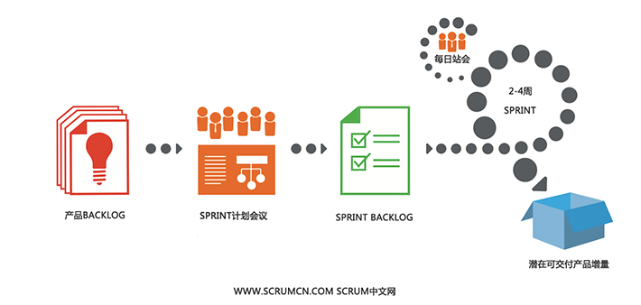

# 敏捷迭代流程

## 基础描述

### SCRUM 是一个用于开发和维持复杂产品的框架
Scrum 是一个用于开发和维持复杂产品的框架 ，是一个增量的、迭代的开发过程。在这个框架中，整个开发过程由若干个短的迭代周期组成，一个短的迭代周期称为一个Sprint，每个Sprint的建议长度是2到4周(互联网产品研发可以使用1周的Sprint)。在Scrum中，使用产品Backlog来管理产品的需求，产品backlog是一个按照商业价值排序的需求列表，列表条目的体现形式通常为用户故事。Scrum团队总是先开发对客户具有较高价值的需求。在Sprint中，Scrum团队从产品Backlog中挑选最高优先级的需求进行开发。挑选的需求在Sprint计划会议上经过讨论、分析和估算得到相应的任务列表，我们称它为Sprint backlog。在每个迭代结束时，Scrum团队将递交潜在可交付的产品增量。 Scrum起源于软件开发项目，但它适用于任何复杂的或是创新性的项目。

### SCRUM框架包括3个角色、3个工件、5个活动、5个价值

#### 3个角色（岗位职责很重要）
* 产品负责人（Product Owner）
* Scrum Master 敏捷教练
* Scrum团队 其他全部成员

#### 3个工件
* 产品Backlog（Product Backlog）
* SprintBacklog 迭代列表
* 产品增量（Increment）

#### 5个活动
* Sprint计划会议（Sprint Planning Meeting）
* 每日站会（Daily Scrum Meeting）
* Sprint评审会议（Sprint Review Meeting）
* Sprint回顾会议（Sprint Retrospective Meeting）
* 产品Backlog梳理会议（ Product Backlog Refinement）

#### 5个价值
* 承诺 – 愿意对目标做出承诺
* 专注– 把你的心思和能力都用到你承诺的工作上去
* 开放– Scrum 把项目中的一切开放给每个人看
* 尊重– 每个人都有他独特的背景和经验
* 勇气– 有勇气做出承诺，履行承诺，接受别人的尊重

## 学习链接
- [SCRUM 中文网](http://www.scrumcn.com/agile/scrum-knowledge-library/scrum.html)

## 我们采用流程
适应我们的才是最重要的

### 迭代流程
- 1.Sprint 计划会议（Sprint Planning Meeting）开工前开完，产出 SprintBacklog 迭代列表 包括：工时理想工作时长 
- 2.每日站会（Daily Scrum Meeting）对每天进度情况跟踪，产出 每天情况说明
- 3.Sprint 评审会议（Sprint Review Meeting）迭代最后一天进行，产出 评审结果
- 4.Sprint 回顾会议（Sprint Retrospective Meeting）Sprint评审会议 后进行，产出 回顾结果
- 5.产品 Backlog 梳理会议（ Product Backlog Refinement）明确下个阶段，产出 SprintBacklog 迭代列表

** 注：**
一个Sprint 包含2个星期,则Sprint评审/回顾会议时⻓长为2个小时

## 参考资料
- [你大概走了假敏捷：认真说说敏捷的实现和问题（手绘版）](https://www.qcloud.com/community/article/766331?fromSource=gwzcw.93748.93748.93748)