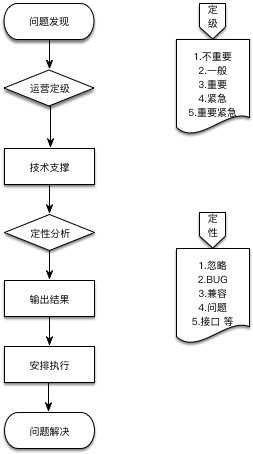

# 上线后运维流程

## 流程图


## 流程描述

### 1.问题发现：
    需要在 [缺陷] 创建缺陷，并且，提供如下描述：
    ```
    [缺陷描述]：
    [重现步骤]：
    [期望结果]：
    [实际结果]：
    ```
    图文并述会更好

###  2.运营定级：
    确定本缺陷的等级和是否修复，并且，给出回复定级结果

    ```
    1.不重要：可以不整改，并且，关闭本缺陷
    2.一般：等待排期整改
    3.重要：下个周期优先整改
    4.紧急：本排期整改
    5.重要紧急：马上整改
    ```


###  3.技术定级：

    补全下面说明

    ```
    [原因定位]：
    [修复建议]： 
    ```

    定级说明：
    ```
    1.忽略：忽略不计
    2.BUG：说明形成原因
    3.兼容：说明兼容机器和问题
    4.问题：对问题进行描述说明
    5.接口：提供接口调整说明
    ```

###  4.安排执行：
结合当前排期进行安排，纳入迭代周期

## 紧急流程
直接整理一封邮件描述问题，并且，直接找到 运营、产品、技术、总负责人 进行协调

必要条件：必须整理一封邮件描述事情